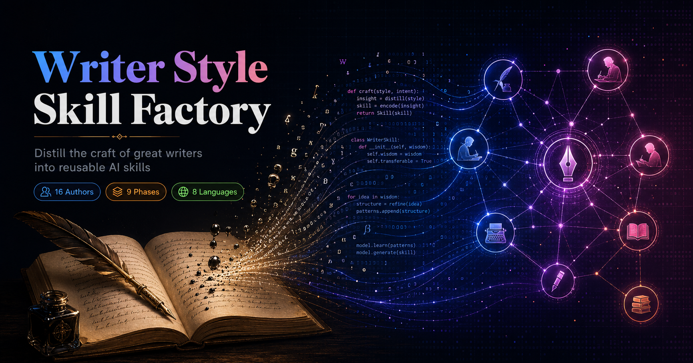
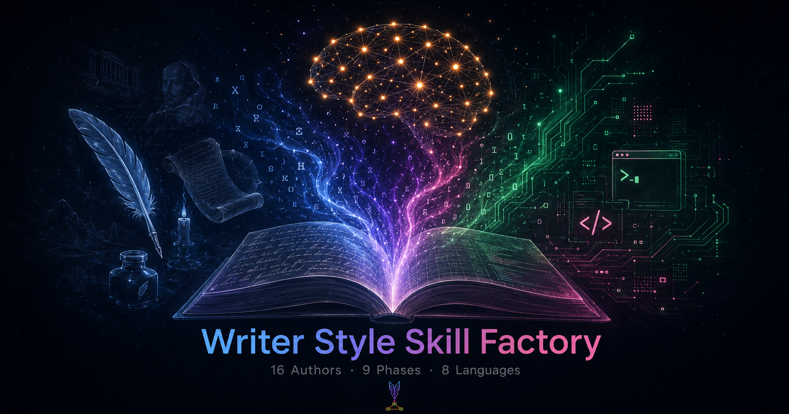
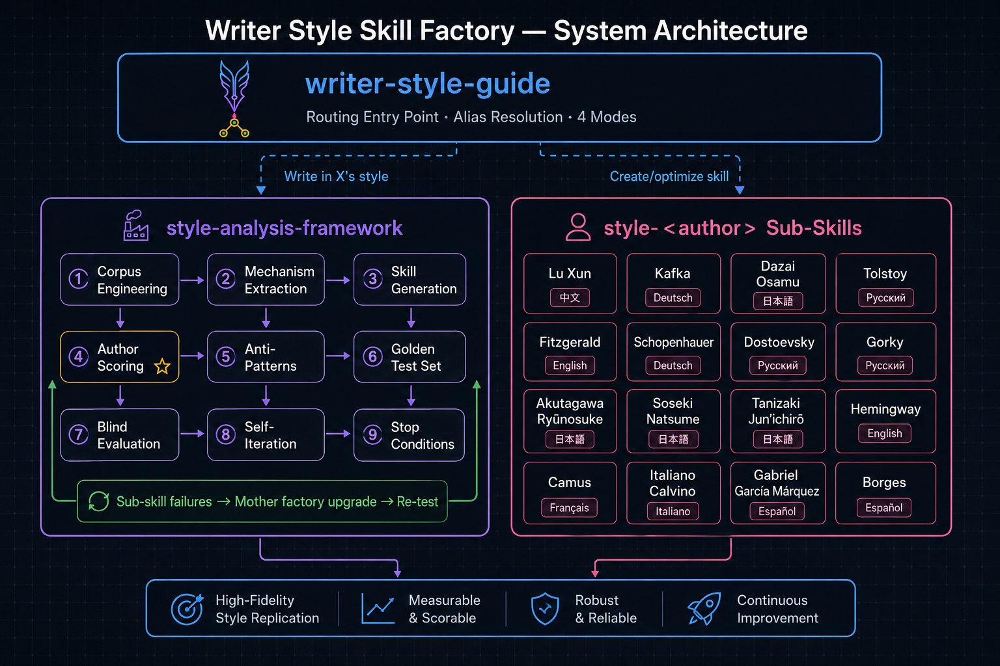
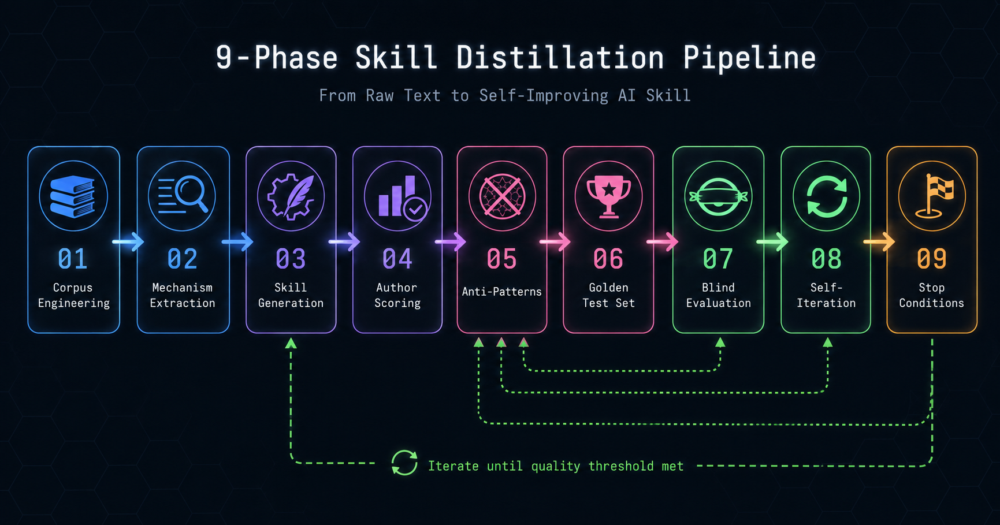
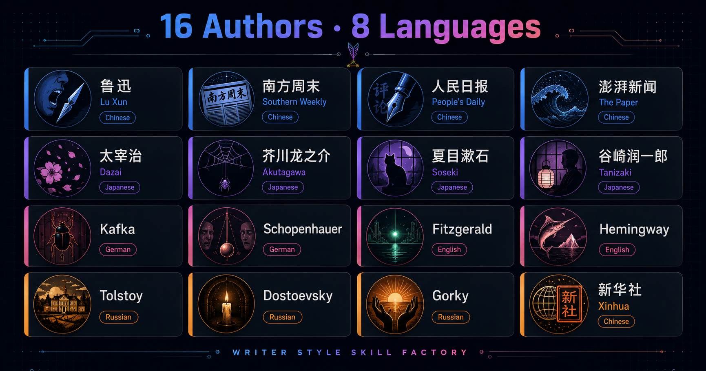

<p align="center">
  <a href="README.md">🇺🇸 English</a> &nbsp;|&nbsp; <a href="README_zh.md">🇨🇳 中文</a>
</p>

<p align="center">
  
</p>

<p align="center">
  
</p>

<p align="center">
  <strong>Distill the craft of great writers into reusable, testable, and self-improving AI skills.</strong>
</p>

<p align="center">
  <a href="https://github.com/christopher47634/writer-style-skill-factory/blob/main/LICENSE"></a>
  
  
  
  <a href="https://hermes-agent.nousresearch.com"></a>
</p>

<p align="center">
  <a href="#-quick-start">Quick Start</a> ·
  <a href="#-architecture">Architecture</a> ·
  <a href="#-included-authors">Authors</a> ·
  <a href="#-usage-examples">Usage</a> ·
  <a href="#-create-your-own">Create New Author</a>
</p>

---

## What Is This

<p align="center">
  
</p>

Most AI "writing style" prompts are surface-level keyword swaps — *add some short sentences for Lu Xun*, *mention alienation for Kafka*. The result reads like a costume, not a voice.

**Writer Style Skill Factory** is different. It's a 3-layer system that:

1. **Researches** an author's original-language corpus across periods and genres
2. **Extracts** 4-8 distinguishing craft mechanisms (narrator distance, sentence rhythm, emotion generation, structural logic — not vocabulary)
3. **Generates** executable skills that produce high-recognition writing on *any* topic
4. **Tests** every skill through blind evaluation against no-skill baselines
5. **Self-improves** by feeding sub-skill failures back into the mother factory

The result: AI writing that captures *how* an author thinks, not just *what* they say.

---

## Architecture

<p align="center">
  
</p>

### Three Layers

| Layer | Component | Role |
|:-----:|-----------|------|
| 🚪 | **writer-style-guide** | Entry point. Routes "write in X's style" to the right sub-skill; routes "create/optimize skill" to the mother factory. Maintains author alias table. |
| 🏭 | **style-analysis-framework** | 9-phase mother factory. Handles corpus engineering → mechanism extraction → skill generation → scoring → blind testing → self-iteration. |
| ✍️ | **style-\<author\>** | 16 sub-skills. Each receives a topic and produces a finished piece in that author's voice — with bilingual output for non-Chinese authors. |

### The 9 Phases

<p align="center">
  
</p>

| Phase | What It Does | Why It Matters |
|:-----:|-------------|----------------|
| ① | **Corpus Engineering** | Collects original-language works across periods. Tags evidence as `corpus_fact`, `stable_pattern`, `local_pattern`, or `generation_hypothesis`. |
| ② | **Mechanism Extraction** | Finds 4-8 distinguishing craft mechanisms — not surface vocabulary. Each must pass: *Can it change output? Is it distinctive? Does it work on 2+ topics?* |
| ③ | **Skill Generation** | Produces a `SKILL.md` with hard output contract, 4 author-specific metrics, 3-draft competition, anti-patterns, and bilingual protocol. |
| ④ | **Author Scoring** | 7-dimension rubric (recognition 30%, voice 15%, structure 15%, syntax 15%, character 10%, fluency 10%, originality 5%). Threshold: 90/100. |
| ⑤ | **Anti-Patterns** | 5-10 "cheap similarity" traps per author. *Kafka ≠ bureaucrat + weird + no ending. Lu Xun ≠ short sentences + harsh words.* |
| ⑥ | **Golden Test Set** | 15-30 prompts: typical, non-typical, modern life, relationship, very short, long, bilingual, "trick me into copying" prompts. |
| ⑦ | **Blind Evaluation** | Old vs candidate vs no-skill baseline. Must beat old by ≥3 pts on ≥75% of non-typical prompts. Independent reviewers, no label leakage. |
| ⑧ | **Self-Iteration** | Cross-author failures feed back into the mother factory. Only verified improvements survive — tested on 3+ diverse authors. |
| ⑨ | **Stop Conditions** | Freezes when 5+ authors average 90+, new authors score 85+ on first try, and two consecutive rounds show no improvement. |

---

## Included Authors

<p align="center">
  
</p>

<table>
<tr>
<td align="center" width="120">
  <strong>鲁迅</strong><br/>
  <sub>Lu Xun</sub><br/>
  <code>style-luxun</code><br/>
  <sub>🇨🇳 中文</sub><br/>
  <sub>小说 · 杂文 · 散文</sub>
</td>
<td align="center" width="120">
  <strong>太宰治</strong><br/>
  <sub>Dazai Osamu</sub><br/>
  <code>style-dazai</code><br/>
  <sub>🇯🇵 日本語</sub><br/>
  <sub>小説 · 随筆</sub>
</td>
<td align="center" width="120">
  <strong>芥川龙之介</strong><br/>
  <sub>Akutagawa</sub><br/>
  <code>style-akutagawa</code><br/>
  <sub>🇯🇵 日本語</sub><br/>
  <sub>短編 · 寓話</sub>
</td>
<td align="center" width="120">
  <strong>夏目漱石</strong><br/>
  <sub>Natsume Sōseki</sub><br/>
  <code>style-soseki</code><br/>
  <sub>🇯🇵 日本語</sub><br/>
  <sub>小説 · 随筆</sub>
</td>
<td align="center" width="120">
  <strong>谷崎润一郎</strong><br/>
  <sub>Tanizaki</sub><br/>
  <code>style-tanizaki</code><br/>
  <sub>🇯🇵 日本語</sub><br/>
  <sub>短編 · 感覚小説</sub>
</td>
</tr>
<tr>
<td align="center">
  <strong>卡夫卡</strong><br/>
  <sub>Franz Kafka</sub><br/>
  <code>style-kafka</code><br/>
  <sub>🇩🇪 Deutsch</sub><br/>
  <sub>Fiction · Parable</sub>
</td>
<td align="center">
  <strong>叔本华</strong><br/>
  <sub>Schopenhauer</sub><br/>
  <code>style-schopenhauer</code><br/>
  <sub>🇩🇪 Deutsch</sub><br/>
  <sub>Philosophy · Essay</sub>
</td>
<td align="center">
  <strong>陀思妥耶夫斯基</strong><br/>
  <sub>Dostoevsky</sub><br/>
  <code>style-dostoevsky</code><br/>
  <sub>🇷🇺 Русский</sub><br/>
  <sub>Fiction · Monologue</sub>
</td>
<td align="center">
  <strong>托尔斯泰</strong><br/>
  <sub>Leo Tolstoy</sub><br/>
  <code>style-tolstoy</code><br/>
  <sub>🇷🇺 Русский</sub><br/>
  <sub>Fiction · Epic</sub>
</td>
<td align="center">
  <strong>高尔基</strong><br/>
  <sub>Maxim Gorky</sub><br/>
  <code>style-gorky</code><br/>
  <sub>🇷🇺 Русский</sub><br/>
  <sub>Fiction · Social</sub>
</td>
</tr>
<tr>
<td align="center">
  <strong>菲茨杰拉德</strong><br/>
  <sub>F. Scott Fitzgerald</sub><br/>
  <code>style-fitzgerald</code><br/>
  <sub>🇺🇸 English</sub><br/>
  <sub>Fiction · Lyrical</sub>
</td>
<td align="center">
  <strong>南方周末</strong><br/>
  <sub>Southern Weekly</sub><br/>
  <code>style-nanfang-zhoumo</code><br/>
  <sub>🇨🇳 中文</sub><br/>
  <sub>深度报道 · 特稿</sub>
</td>
<td align="center">
  <strong>人民日报</strong><br/>
  <sub>People's Daily</sub><br/>
  <code>style-renmin-ribao</code><br/>
  <sub>🇨🇳 中文</sub><br/>
  <sub>评论 · 理论</sub>
</td>
<td align="center">
  <strong>澎湃新闻</strong><br/>
  <sub>The Paper</sub><br/>
  <code>style-thepaper</code><br/>
  <sub>🇨🇳 中文</sub><br/>
  <sub>解释性报道</sub>
</td>
<td align="center">
  <strong>新华社</strong><br/>
  <sub>Xinhua</sub><br/>
  <code>style-xinhua</code><br/>
  <sub>🇨🇳 中文</sub><br/>
  <sub>通稿 · 数据稿</sub>
</td>
</tr>
<tr>
<td align="center" colspan="5">
  <strong>小约翰可汗</strong> &nbsp;
  <sub>Xiaoyuehan Kehan</sub> &nbsp;
  <code>style-xiaoyuehan-kehan</code> &nbsp;
  <sub>🇨🇳 中文</sub> &nbsp;
  <sub>知识叙事 · 历史口播</sub>
</td>
</tr>
</table>

---

## Quick Start

```bash
# Clone the repo
git clone https://github.com/christopher47634/writer-style-skill-factory.git
cd writer-style-skill-factory

# Install the router
hermes skills install ./writer-style-guide

# Install the mother factory
hermes skills install ./style-analysis-framework

# Install all author sub-skills
for d in style-*/; do hermes skills install "./$d"; done
```

<details>
<summary><strong>Install only specific authors</strong></summary>

```bash
# Japanese authors only
hermes skills install ./style-akutagawa
hermes skills install ./style-dazai
hermes skills install ./style-soseki
hermes skills install ./style-tanizaki

# Chinese literary authors
hermes skills install ./style-luxun
hermes skills install ./style-xiaoyuehan-kehan

# Journalism / media style
hermes skills install ./style-nanfang-zhoumo
hermes skills install ./style-renmin-ribao
hermes skills install ./style-thepaper
hermes skills install ./style-xinhua

# Just the framework (for creating new authors)
hermes skills install ./style-analysis-framework
```

</details>

---

## Usage Examples

### Write in an Author's Style

Once installed, just talk to your AI naturally:

| You Say | System Does |
|---------|-------------|
| "用鲁迅的方式写一篇关于内卷的杂文" | Loads `style-luxun` → generates in Lu Xun's voice |
| "Write a short story in Kafka's style about online shopping" | Loads `style-kafka` → German original + Chinese translation |
| "以托尔斯泰的笔法写一个晚宴场景" | Loads `style-tolstoy` → English original + Chinese translation |
| "用南方周末的风格写一篇关于AI教育的深度报道" | Loads `style-nanfang-zhoumo` → Chinese long-form journalism |

### Create a New Author Skill

```
"做一个海明威文风 skill"
"帮我蒸馏村上春树的写作风格"
"新增 style-borges"
```

The mother factory will:
1. Research the author's original-language corpus
2. Extract 4-8 distinguishing mechanisms
3. Generate a complete `style-<author>/SKILL.md`
4. Create `test-prompts.json` with 15-30 test prompts
5. Run blind evaluation against no-skill baseline
6. Deliver the finished skill

### Optimize an Existing Skill

```
"太宰治写得不像，优化一下"
"这篇鲁迅风格更像网络散文"
"卡夫卡的荒诞感不够强"
```

The system runs blind tests (old vs candidate vs baseline) and only keeps the improvement if it wins.

### Iterate the Mother Factory

```
"让以后生成的作者 skill 都更强"
"最近几个作者写得都不够好，迭代母工厂"
```

Aggregates failures across multiple authors → modifies the framework → re-tests on 3+ diverse authors → keeps changes only if ≥2/3 improve.

---

## How Each Sub-Skill Works

Every `style-<author>/SKILL.md` follows a strict 9-section structure:

```
1. Hard Output Contract        — Bilingual by default, no preamble, no self-commentary
2. Native Language Protocol     — Original language first, then literary translation
3. 4 Quality Metrics            — Author-specific scoring dimensions (30% weight)
4. Core Generation Mechanisms   — The actual craft rules, not surface keywords
5. Genre Routing                — How to handle fiction vs essay vs journalism
6. 3-Draft Competition          — Generate 3 candidates with different focus, pick best
7. Anti-Patterns                — 5-10 "cheap similarity" traps to avoid
8. Final Delivery Checklist     — Last-gate quality control
9. Corpus Boundaries            — What evidence supports each rule
```

### Example: What Makes Kafka *Kafka*

Not this: ❌ *bureaucracy + weird event + no resolution + short sentences*

This: ✅
- **Narrator distance**: Clinical observer who describes impossible events with bureaucratic calm
- **Progressive constraint**: Each paragraph tightens the rules by exactly one notch
- **Body as signal**: Physical discomfort (stiff neck, cramped room) replaces emotional description
- **Structural recursion**: The character's attempt to fix the problem becomes the problem

---

## Validation

Run the built-in validator to check all skills:

```bash
python3 validate.py
```

```
============================================================
RESULTS: 341 passed, 0 failed, 5 warnings
============================================================
```

Checks: frontmatter structure, name/description fields, UTF-8 encoding, BOM detection, line count limits, test prompt validity, section presence, security (no secrets/keys/logs).

---

## Project Structure

```
writer-style-skill-factory/
│
├── assets/
│   ├── banner_en.png                       # Hero banner (English)
│   ├── banner_zh.png                       # Hero banner (Chinese)
│   ├── logo.png                            # Project logo
│   ├── architecture_en.png                 # Architecture diagram (EN)
│   ├── architecture_zh.png                 # Architecture diagram (ZH)
│   ├── authors_en.png                      # Author matrix (EN)
│   ├── authors_zh.png                      # Author matrix (ZH)
│   ├── pipeline_en.png                     # 9-phase pipeline (EN)
│   ├── pipeline_zh.png                     # 9-phase pipeline (ZH)
│   ├── concept_en.png                      # Concept illustration
│   ├── prompts.md                          # DALL-E prompts for regenerating images
│   ├── banner.svg                          # SVG banner (fallback)
│   └── architecture.svg                    # SVG architecture (fallback)
│
├── writer-style-guide/                     # 🚪 Entry Point
│   ├── SKILL.md                            #    Routing rules + author alias table
│   └── test-prompts.json                   #    5 routing test prompts
│
├── style-analysis-framework/               # 🏭 Mother Factory
│   ├── SKILL.md                            #    9-phase creation/iteration framework
│   ├── test-prompts.json                   #    5 framework test prompts
│   └── results.tsv                         #    Iteration history log
│
├── style-akutagawa/                        # ✍️ Author Skills (×16)
│   ├── SKILL.md                            #    9-section skill (≤500 lines)
│   └── test-prompts.json                   #    3+ test prompts
├── style-dazai/
│   └── ...
├── style-dostoevsky/
├── style-fitzgerald/
├── style-gorky/
├── style-kafka/
├── style-luxun/
├── style-nanfang-zhoumo/
├── style-renmin-ribao/
├── style-schopenhauer/
├── style-soseki/
├── style-tanizaki/
├── style-thepaper/
├── style-tolstoy/
├── style-xiaoyuehan-kehan/
├── style-xinhua/
│
├── validate.py                             # Automated validation script
├── README.md                               # This file
└── .gitignore                              # Excludes secrets, cache, logs
```

---

## Create Your Own Author Skill

### Option 1: Use the System (Recommended)

Just tell your AI:

```
"做一个 [author name] 文风 skill"
```

The mother factory handles everything: corpus research, mechanism extraction, skill generation, test creation, and blind evaluation.

### Option 2: Manual Creation

1. Create the directory and files:
```bash
mkdir style-<author>
```

2. Write `SKILL.md` following the 9-section structure defined in `style-analysis-framework/SKILL.md`

3. Create `test-prompts.json`:
```json
[
  {
    "prompt": "Write a short scene about...",
    "genre": "fiction",
    "typicality": "typical",
    "language": "bilingual"
  },
  {
    "prompt": "Describe a modern city street...",
    "genre": "essay",
    "typicality": "non-typical",
    "language": "bilingual"
  }
]
```

4. Register the alias in `writer-style-guide/SKILL.md`

5. Validate:
```bash
python3 validate.py
```

---

## Evidence Levels

Every rule in a sub-skill is tagged with an evidence level:

| Level | Meaning | Can Enter Core Protocol? |
|-------|---------|:------------------------:|
| `corpus_fact` | Verifiable from source text | ❌ Reference only |
| `stable_pattern` | Repeated across multiple works | ✅ Yes |
| `local_pattern` | Specific to one work or period | ⚠️ With disclaimer |
| `generation_hypothesis` | Awaiting real-world test | ✅ After blind test passes |

---

## Contributing

### Improve an Author Skill

1. Identify what's wrong (cheap similarity, wrong tone, structural issues)
2. Tell the system: `"优化 style-<author>，问题是..."`
3. The mother factory runs blind tests and keeps only improvements

### Improve the Mother Factory

1. Identify cross-author patterns
2. Tell the system: `"迭代母工厂，问题是..."`
3. Framework tests changes on 3+ diverse authors before committing

### Pull Requests Welcome

- Fix a specific author skill
- Add test prompts
- Improve documentation
- Report issues with generated output quality

---

## License

[MIT](LICENSE)

---

<p align="center">
  <sub>Built with <a href="https://hermes-agent.nousresearch.com">Hermes Agent</a> by Nous Research</sub><br/>
  <sub>Author corpus analysis methodology inspired by close reading traditions in literary criticism,<br/>adapted for LLM prompt engineering.</sub>
</p>
