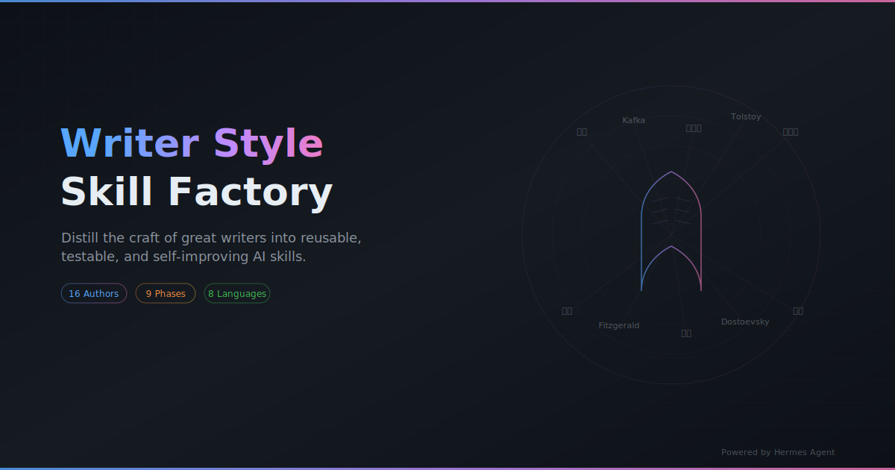
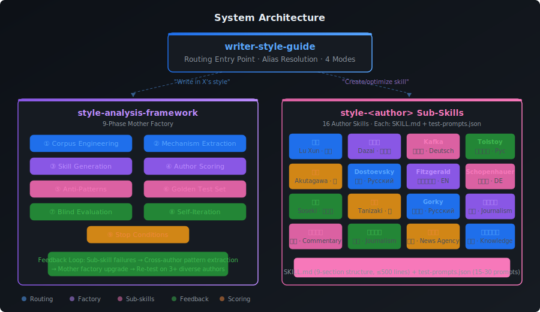

<p align="center">
  
</p>

<p align="center">
  <strong>把伟大作家的写作技艺蒸馏成可复用、可测试、可自我进化的 AI Skill。</strong>
</p>

<p align="center">
  <a href="https://github.com/christopher47634/writer-style-skill-factory/blob/main/LICENSE"></a>
  
  
  
  <a href="https://hermes-agent.nousresearch.com"></a>
</p>

<p align="center">
  <a href="#-快速安装">快速安装</a> ·
  <a href="#-系统架构">架构</a> ·
  <a href="#-已收录作家">作家</a> ·
  <a href="#-调用示例">调用</a> ·
  <a href="#-创建新作者-skill">创建新作者</a> ·
  <a href="README.md">English</a>
</p>

---

## 这是什么

市面上大多数"AI 文风模仿"是关键词替换——*鲁迅就加短句，卡夫卡就写怪事*。结果像cosplay，不像写作。

**Writer Style Skill Factory** 不同。它是一个三层系统：

1. **研究**作者的母语原文语料，跨越不同创作时期和体裁
2. **提取** 4-8 个可区分的写作技艺机制（叙述距离、句法节奏、情绪生成方式、结构推进逻辑——不是词汇）
3. **生成**可执行的 Skill，在任何题材上都能产出高辨识度的作品
4. **测试**每个 skill 都经过盲测，与无 skill 基线对比
5. **自我进化**把子 skill 的失败反馈回母工厂

最终效果：AI 写作捕捉的是作者*怎么想*，而不只是*说了什么*。

---

## 系统架构

<p align="center">
  
</p>

### 三层分工

| 层级 | 组件 | 职责 |
|:----:|------|------|
| 🚪 | **writer-style-guide** | 总入口。路由"用 X 的风格写"到对应子 skill；路由"创建/优化 skill"到母工厂。维护作者别名表。 |
| 🏭 | **style-analysis-framework** | 9 阶段母工厂。负责语料工程 → 机制提取 → skill 生成 → 评分 → 盲测 → 自我迭代。 |
| ✍️ | **style-\<author\>** | 16 个子 skill。接收主题，直接生成对应文风的成稿——非中文作者默认双语输出。 |

### 9 阶段详解

| 阶段 | 做什么 | 为什么重要 |
|:----:|--------|-----------|
| ① | **语料工程** | 收集母语原文，按 `corpus_fact`、`stable_pattern`、`local_pattern`、`generation_hypothesis` 分层标记。 |
| ② | **机制提取** | 找出 4-8 个区分性技艺机制，不是表面词汇。每条必须通过：*能改变输出吗？够独特吗？两个题材能复现吗？* |
| ③ | **Skill 生成** | 产出 `SKILL.md`，包含硬输出契约、4 项作者专属指标、三稿竞争、反模式、双语协议。 |
| ④ | **作者评分** | 7 维度评分（辨识度 30%、叙述声音 15%、结构 15%、句法 15%、人物 10%、母语自然度 10%、原创性 5%）。门槛：90 分。 |
| ⑤ | **反模式** | 每个作者 5-10 条"廉价相似"陷阱。*卡夫卡 ≠ 官僚 + 怪事 + 无解。鲁迅 ≠ 短句 + 尖刻。* |
| ⑥ | **黄金测试集** | 15-30 个测试题：典型题材、非典型、现代生活、关系、极短、长文、双语、"诱导复刻原作"。 |
| ⑦ | **盲测** | 旧版 vs 候选版 vs 无 skill 基线。候选必须在 ≥75% 非典型题上胜出 ≥3 分。独立评审，标签不泄露。 |
| ⑧ | **自我迭代** | 跨作者失败反馈回母工厂。只保留经过 3+ 位不同作者验证的改进。 |
| ⑨ | **停止条件** | 5+ 位作者平均 90+、新作者首轮 85+、连续两轮无改善时冻结。 |

---

## 已收录作家

<table>
<tr>
<td align="center" width="120">
  <strong>鲁迅</strong><br/>
  <sub>Lu Xun</sub><br/>
  <code>style-luxun</code><br/>
  <sub>🇨🇳 中文</sub><br/>
  <sub>小说 · 杂文 · 散文</sub>
</td>
<td align="center" width="120">
  <strong>太宰治</strong><br/>
  <sub>Dazai Osamu</sub><br/>
  <code>style-dazai</code><br/>
  <sub>🇯🇵 日本語</sub><br/>
  <sub>小説 · 随筆</sub>
</td>
<td align="center" width="120">
  <strong>芥川龙之介</strong><br/>
  <sub>Akutagawa</sub><br/>
  <code>style-akutagawa</code><br/>
  <sub>🇯🇵 日本語</sub><br/>
  <sub>短編 · 寓話</sub>
</td>
<td align="center" width="120">
  <strong>夏目漱石</strong><br/>
  <sub>Natsume Sōseki</sub><br/>
  <code>style-soseki</code><br/>
  <sub>🇯🇵 日本語</sub><br/>
  <sub>小説 · 随筆</sub>
</td>
<td align="center" width="120">
  <strong>谷崎润一郎</strong><br/>
  <sub>Tanizaki</sub><br/>
  <code>style-tanizaki</code><br/>
  <sub>🇯🇵 日本語</sub><br/>
  <sub>短編 · 感覚小説</sub>
</td>
</tr>
<tr>
<td align="center">
  <strong>卡夫卡</strong><br/>
  <sub>Franz Kafka</sub><br/>
  <code>style-kafka</code><br/>
  <sub>🇩🇪 Deutsch</sub><br/>
  <sub>Fiction · Parable</sub>
</td>
<td align="center">
  <strong>叔本华</strong><br/>
  <sub>Schopenhauer</sub><br/>
  <code>style-schopenhauer</code><br/>
  <sub>🇩🇪 Deutsch</sub><br/>
  <sub>Philosophy · Essay</sub>
</td>
<td align="center">
  <strong>陀思妥耶夫斯基</strong><br/>
  <sub>Dostoevsky</sub><br/>
  <code>style-dostoevsky</code><br/>
  <sub>🇷🇺 Русский</sub><br/>
  <sub>Fiction · Monologue</sub>
</td>
<td align="center">
  <strong>托尔斯泰</strong><br/>
  <sub>Leo Tolstoy</sub><br/>
  <code>style-tolstoy</code><br/>
  <sub>🇷🇺 Русский</sub><br/>
  <sub>Fiction · Epic</sub>
</td>
<td align="center">
  <strong>高尔基</strong><br/>
  <sub>Maxim Gorky</sub><br/>
  <code>style-gorky</code><br/>
  <sub>🇷🇺 Русский</sub><br/>
  <sub>Fiction · Social</sub>
</td>
</tr>
<tr>
<td align="center">
  <strong>菲茨杰拉德</strong><br/>
  <sub>F. Scott Fitzgerald</sub><br/>
  <code>style-fitzgerald</code><br/>
  <sub>🇺🇸 English</sub><br/>
  <sub>Fiction · Lyrical</sub>
</td>
<td align="center">
  <strong>南方周末</strong><br/>
  <sub>Southern Weekly</sub><br/>
  <code>style-nanfang-zhoumo</code><br/>
  <sub>🇨🇳 中文</sub><br/>
  <sub>深度报道 · 特稿</sub>
</td>
<td align="center">
  <strong>人民日报</strong><br/>
  <sub>People's Daily</sub><br/>
  <code>style-renmin-ribao</code><br/>
  <sub>🇨🇳 中文</sub><br/>
  <sub>评论 · 理论</sub>
</td>
<td align="center">
  <strong>澎湃新闻</strong><br/>
  <sub>The Paper</sub><br/>
  <code>style-thepaper</code><br/>
  <sub>🇨🇳 中文</sub><br/>
  <sub>解释性报道</sub>
</td>
<td align="center">
  <strong>新华社</strong><br/>
  <sub>Xinhua</sub><br/>
  <code>style-xinhua</code><br/>
  <sub>🇨🇳 中文</sub><br/>
  <sub>通稿 · 数据稿</sub>
</td>
</tr>
<tr>
<td align="center" colspan="5">
  <strong>小约翰可汗</strong> &nbsp;
  <sub>Xiaoyuehan Kehan</sub> &nbsp;
  <code>style-xiaoyuehan-kehan</code> &nbsp;
  <sub>🇨🇳 中文</sub> &nbsp;
  <sub>知识叙事 · 历史口播</sub>
</td>
</tr>
</table>

**覆盖 8 种语言：** 中文、日本語、Deutsch、English、Русский、以及通过翻译研究的法语、意大利语、西班牙语语料。

---

## 快速安装

```bash
# 克隆仓库
git clone https://github.com/christopher47634/writer-style-skill-factory.git
cd writer-style-skill-factory

# 安装路由入口
hermes skills install ./writer-style-guide

# 安装母工厂
hermes skills install ./style-analysis-framework

# 安装全部子 skill
for d in style-*/; do hermes skills install "./$d"; done
```

<details>
<summary><strong>只安装特定作家</strong></summary>

```bash
# 日本作家
hermes skills install ./style-akutagawa
hermes skills install ./style-dazai
hermes skills install ./style-soseki
hermes skills install ./style-tanizaki

# 中文文学
hermes skills install ./style-luxun
hermes skills install ./style-xiaoyuehan-kehan

# 新闻 / 媒体文风
hermes skills install ./style-nanfang-zhoumo
hermes skills install ./style-renmin-ribao
hermes skills install ./style-thepaper
hermes skills install ./style-xinhua

# 只装母工厂（用于创建新作者）
hermes skills install ./style-analysis-framework
```

</details>

---

## 调用示例

### 用某作家文风写作

安装后直接跟 AI 说：

| 你说 | 系统做什么 |
|------|-----------|
| "用鲁迅的方式写一篇关于内卷的杂文" | 加载 `style-luxun` → 以鲁迅口吻生成 |
| "Write a short story in Kafka's style about online shopping" | 加载 `style-kafka` → 德语原文 + 中文翻译 |
| "以托尔斯泰的笔法写一个晚宴场景" | 加载 `style-tolstoy` → 英语原文 + 中文翻译 |
| "用南方周末的风格写一篇关于AI教育的深度报道" | 加载 `style-nanfang-zhoumo` → 中文深度报道 |

### 创建新作者 Skill

```
"做一个海明威文风 skill"
"帮我蒸馏村上春树的写作风格"
"新增 style-borges"
```

母工厂会：研究母语语料 → 提取 4-8 个技艺机制 → 生成完整 SKILL.md → 创建测试题 → 盲测评估 → 交付。

### 优化现有 Skill

```
"太宰治写得不像，优化一下"
"这篇鲁迅风格更像网络散文"
```

系统跑盲测（旧版 vs 候选 vs 基线），只保留胜出版本。

### 迭代母工厂

```
"让以后生成的作者 skill 都更强"
```

聚合多作者失败 → 修改框架 → 3+ 位作者验证 → ≥2/3 提升才保留。

---

## 每个子 Skill 的结构

每个 `style-<author>/SKILL.md` 严格遵循 9 段结构：

| 段落 | 内容 |
|:----:|------|
| 1 | **硬输出契约** — 默认双语，无寒暄，无自检，无摘要 |
| 2 | **母语协议** — 先母语原稿，再逐段文学翻译 |
| 3 | **4 项专属指标** — 作者独有的辨识度维度 |
| 4 | **核心生成机制** — 真正的技艺规则，不是表面关键词 |
| 5 | **体裁路由** — 小说 vs 随笔 vs 新闻的不同处理 |
| 6 | **三稿竞争** — 生成 3 个不同重心的候选，选最优 |
| 7 | **专属反模式** — 5-10 条"廉价相似"陷阱 |
| 8 | **最终交付检查** — 最后一道质量门 |
| 9 | **语料边界** — 每条规则的证据来源 |

### 举例：卡夫卡为什么是卡夫卡

不是这样：❌ *官僚 + 怪事 + 无解 + 短句*

是这样：✅
- **叙述距离**：临床观察者，用公文的冷静描述不可能事件
- **递进约束**：每段恰好收紧一个规则等级
- **身体信号**：用身体不适（脖子僵硬、房间逼仄）替代情绪描写
- **结构递归**：角色解决问题的尝试本身成为问题

---

## 校验

```bash
python3 validate.py
```

```
============================================================
RESULTS: 341 passed, 0 failed, 5 warnings
============================================================
```

检查项：frontmatter 结构、name/description 字段、UTF-8 编码、BOM 检测、行数限制、测试题有效性、章节完整性、安全（无密钥/日志/缓存）。

---

## 创建你自己的作者 Skill

### 方式一：用系统创建（推荐）

```
"做一个 [作者名] 文风 skill"
```

母工厂全自动：语料研究 → 机制提取 → skill 生成 → 测试创建 → 盲测评估。

### 方式二：手动创建

1. 创建目录：`mkdir style-<author>`
2. 按 `style-analysis-framework/SKILL.md` 中定义的 9 段结构写 `SKILL.md`
3. 创建 `test-prompts.json`（至少 3 个测试题）
4. 在 `writer-style-guide/SKILL.md` 注册别名
5. 运行校验：`python3 validate.py`

---

## 证据等级

每条规则都有证据标记：

| 等级 | 含义 | 能进入核心协议？ |
|:----:|------|:----------------:|
| `corpus_fact` | 可从语料复核 | ❌ 仅供参考 |
| `stable_pattern` | 跨作品重复出现 | ✅ 可以 |
| `local_pattern` | 仅限某部作品或时期 | ⚠️ 需标注 |
| `generation_hypothesis` | 待实测 | ✅ 盲测通过后 |

---

## 贡献

### 改进某个作家 Skill

1. 识别问题（廉价相似、语调不对、结构问题）
2. 告诉系统：`"优化 style-<author>，问题是..."`
3. 母工厂跑盲测，只保留提升

### 改进母工厂

1. 识别跨作者模式
2. 告诉系统：`"迭代母工厂，问题是..."`
3. 框架在 3+ 位作者上验证后才提交

### 欢迎 PR

- 修复特定作家 skill
- 增加测试题
- 改进文档
- 报告生成质量问题

---

## License

[MIT](LICENSE)

---

<p align="center">
  <sub>Built with <a href="https://hermes-agent.nousresearch.com">Hermes Agent</a> by Nous Research</sub><br/>
  <sub>作者语料分析方法论源自文学批评中的细读传统，经适配用于 LLM 提示工程。</sub>
</p>
